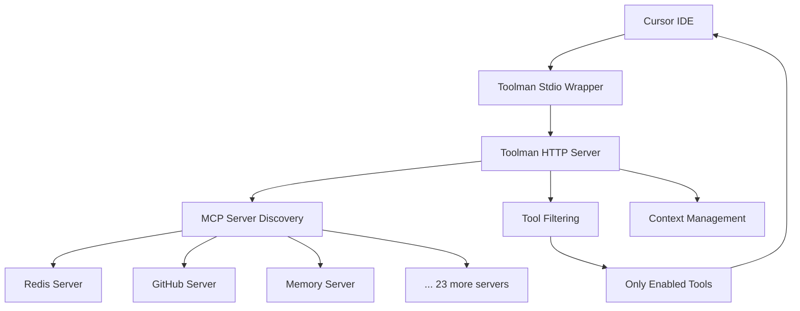

# 🛠️ Toolman

**Your ultimate tool companion for MCP (Model Context Protocol) servers**

Toolman is a production-grade Rust HTTP server that provides intelligent MCP server and tool management for Cursor IDE and Claude Code. It acts as a centralized proxy that manages multiple MCP servers, providing selective tool exposure with dynamic runtime management capabilities.

[](https://www.rust-lang.org)
[](https://opensource.org/licenses/MIT)
[]()

## 🎯 What is Toolman?

Toolman solves the **tool overwhelm problem** in AI development environments. Instead of being flooded with hundreds of tools from dozens of MCP servers, Toolman lets you:

- **Selectively expose** only the tools you need for your current project
- **Dynamically enable/disable** tools at runtime without config file edits
- **Manage multiple projects** with isolated tool contexts
- **Bulk enable** entire server ecosystems with a single command
- **Persist preferences** across sessions and team members

## ✨ Key Features

### 🎛️ Selective Tool Exposure
- **NOT a meta-tool proxy** - exposes only tools marked as `enabled: true`
- Filter out noise, focus on what matters for your current work
- Clean, organized tool lists in Cursor IDE

### ⚡ Dynamic Management
- Enable/disable tools at runtime without restarting
- Bulk operations: enable entire servers with one command
- Ephemeral changes until explicitly saved

### 🏢 Multi-Project Support
- Context-based isolation using project directory hashing
- Different tool sets for different projects
- Team-friendly: share configurations without conflicts

### 🔧 26 Integrated MCP Servers
Currently supporting **278+ tools** across:
- **Redis** (44 tools) - Database operations, vector search, caching
- **GitHub** (26 tools) - Repository management, issues, PRs
- **Browser-MCP/Playwright** (32 tools) - Web automation
- **Task Master AI** (33 tools) - Project management
- **Postgres** (19 tools) - Database operations
- **Docker** (19 tools) - Container management
- **Filesystem** (11 tools) - File operations
- **Memory** (9 tools) - Knowledge graph
- And 18 more...

## 🚀 Quick Start

### Installation

```bash
# Clone the repository
git clone https://github.com/anthropics/toolman.git
cd toolman

# Build the project
cargo build --release

# The binaries will be in target/release/
./target/release/toolman-http --help
./target/release/toolman --help
```

### Basic Usage

1. **Start the HTTP server**:
   ```bash
   # Start with your project directory
   ./target/release/toolman-http --project-dir $(pwd) --port 3002
   ```

2. **Configure Cursor IDE**:
   Add to your `~/.cursor/mcp.json`:
   ```json
   {
     "mcpServers": {
       "toolman": {
         "command": "/path/to/toolman",
         "args": ["--url", "http://localhost:3002/mcp"]
       }
     }
   }
   ```

3. **Enable tools dynamically**:
   ```bash
   # Enable specific tools
   curl -X POST http://localhost:3002/mcp \
     -H "Content-Type: application/json" \
     -d '{"jsonrpc": "2.0", "id": 1, "method": "enable_tool", "params": {"server_name": "memory", "tool_name": "read_graph"}}'

   # Bulk enable entire servers
   curl -X POST http://localhost:3002/mcp \
     -H "Content-Type: application/json" \
     -d '{"jsonrpc": "2.0", "id": 1, "method": "enable_servers", "params": {"server_names": "github,memory,filesystem"}}'
   ```

## 🏗️ Architecture

### Core Components

- **HTTP Server** (`toolman-http`): Main service managing MCP servers
- **Stdio Wrapper** (`toolman`): Bridge for Cursor IDE integration
- **Context Manager**: Multi-project isolation with SHA256 hashing
- **Configuration System**: Atomic updates with backup/recovery

### Tool Management Flow



## 📋 Core Tools

Toolman provides these essential management tools:

### `enable_servers`
Bulk enable all tools from multiple servers:
```json
{"method": "enable_servers", "params": {"server_names": "github,memory,filesystem"}}
```

### `enable_tool`
Enable a specific tool:
```json
{"method": "enable_tool", "params": {"server_name": "memory", "tool_name": "read_graph"}}
```

### `disable_tool`
Disable a specific tool:
```json
{"method": "disable_tool", "params": {"server_name": "memory", "tool_name": "read_graph"}}
```

### `save_config`
Persist ephemeral changes to configuration:
```json
{"method": "save_config", "params": {}}
```

## 🔧 Configuration

### servers-config.json Structure

```json
{
  "servers": {
    "memory": {
      "name": "Memory Server",
      "description": "🧠 Persistent memory and knowledge graph",
      "command": "npx",
      "args": ["-y", "@modelcontextprotocol/server-memory"],
      "tools": {
        "create_entities": { "enabled": true },
        "read_graph": { "enabled": true },
        "search_nodes": { "enabled": false }
      }
    }
  }
}
```

### Context-Based Configuration

- **Storage**: `~/.toolman/contexts/{hash}.json`
- **Hash derived from**: Project directory + optional user_id
- **Contains**: Per-context tool enable/disable preferences
- **Isolation**: Complete separation between projects

## 🧪 Testing

### Run Tests

```bash
# Unit tests
cargo test

# Integration tests
cargo test --test '*'

# Build and test
cargo build --release && cargo test
```

### Manual Testing

```bash
# Start server
nohup ./target/release/toolman-http --project-dir $(pwd) --port 3002 > /tmp/toolman.log 2>&1 &

# Monitor startup (wait for completion - typically 30-60 seconds)
tail -f /tmp/toolman.log

# Test tool listing
curl -X POST http://localhost:3002/mcp \
  -H "Content-Type: application/json" \
  -d '{"jsonrpc": "2.0", "id": 1, "method": "tools/list"}'

# Test through stdio wrapper
echo '{"jsonrpc": "2.0", "id": 1, "method": "tools/list"}' | ./target/release/toolman --url http://localhost:3002/mcp
```

### Cursor UI Testing (CRITICAL)

Features are only complete when confirmed working in Cursor UI:

1. Update `~/.cursor/mcp.json` with Toolman configuration
2. Restart Cursor IDE
3. Verify tools appear in Claude's tool list
4. Test actual tool usage through Claude
5. Confirm dynamic enable/disable works in real-time

## 🚀 Development

### Prerequisites

- Rust 1.70+ (latest stable recommended)
- Node.js (for npm-based MCP servers)
- Python 3.8+ (for Python-based MCP servers)
- Docker (for containerized MCP servers)

### Development Workflow

1. **Make changes** to source code
2. **Build**: `cargo build --release`
3. **Test**: `cargo test && cargo clippy`
4. **Start server**: Monitor logs for 30-60 seconds until completion
5. **Test in Cursor**: Always validate via actual UI
6. **Commit**: After confirming functionality

### Project Structure

```
toolman/
├── src/
│   ├── main.rs              # Stdio wrapper entry point
│   ├── lib.rs               # Core Toolman implementation
│   ├── context.rs           # Multi-user context management
│   ├── errors.rs            # Error types
│   └── bin/
│       └── http_server.rs   # HTTP server implementation
├── servers-config.json      # MCP server configurations
├── Cargo.toml              # Project metadata
└── .taskmaster/            # TaskMaster integration
    └── docs/
        └── project-overview.md  # Authoritative specifications
```

## 📊 Performance

- **Startup Time**: 30-60 seconds for full server discovery
- **Tool Discovery**: Concurrent discovery across all servers
- **Memory Usage**: Efficient caching with bounded growth
- **Response Time**: Sub-100ms for tool operations
- **Concurrency**: Full async/await with Tokio runtime

## 🔒 Security

- Environment variables injected per-request (not globally)
- API keys never logged or exposed in responses
- Configuration backups preserve file permissions
- Input validation on all tool parameters
- Timeout protection on all external MCP server calls

## 🤝 Contributing

We welcome contributions! Please see our development workflow:

1. **Check TaskMaster**: `task-master next` for current priorities
2. **Create feature branch**: `git checkout -b feature/your-feature`
3. **Implement with tests**: Always include comprehensive tests
4. **Test in Cursor UI**: Validate real-world functionality
5. **Submit PR**: With clear description and test evidence

### Development Tools

This project uses **TaskMaster** for task management:

```bash
# View current tasks
task-master list

# See what to work on next
task-master next

# View specific task
task-master show 12.1

# Update progress
task-master update-subtask --id=12.1 --prompt="Implementation progress..."
```

## 📄 License

This project is licensed under the MIT License - see the [LICENSE](LICENSE) file for details.

## 🙏 Acknowledgments

- **MCP Protocol**: Built on the Model Context Protocol standard
- **Rust Community**: For excellent async and HTTP libraries
- **Cursor IDE**: For the inspiration to solve tool management
- **Contributors**: Everyone who helped make Toolman better

---

**Toolman** - *Your ultimate tool companion* 🛠️

*Making AI development environments cleaner, faster, and more focused.*