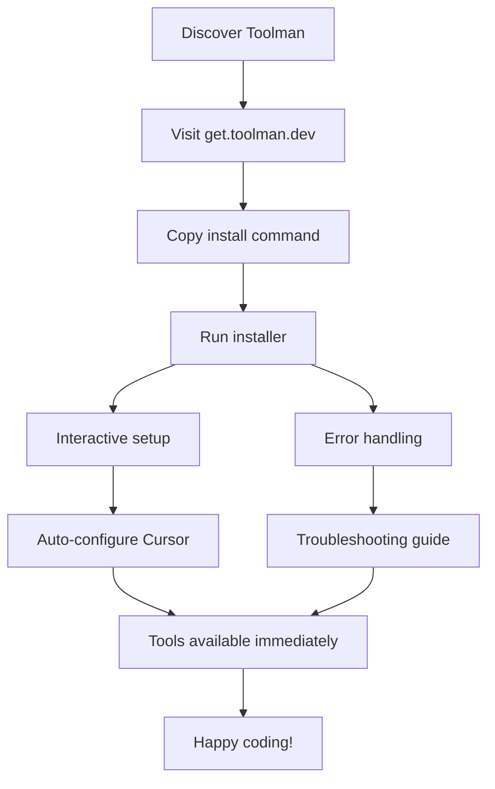

# Toolman Packaging & Distribution Strategy

**Version:** 1.0
**Date:** December 2024
**Project:** MCP Bridge Proxy (Toolman)

## Executive Summary

This document outlines the comprehensive packaging and distribution strategy for Toolman, the MCP Bridge Proxy that enables dynamic tool management for Cursor IDE and other MCP clients. The strategy focuses on delivering a seamless, one-command installation experience across macOS (Intel/Apple Silicon) and Linux platforms.

## Table of Contents

1. [User Experience & Journey](#user-experience--journey)
2. [Distribution Methods](#distribution-methods)
3. [Technical Architecture](#technical-architecture)
4. [Implementation Details](#implementation-details)
5. [Build & Release Pipeline](#build--release-pipeline)
6. [Quality Assurance](#quality-assurance)
7. [Rollout Plan](#rollout-plan)

---

## User Experience & Journey

### Primary User Personas

1. **AI-Powered Developers**: Using Cursor IDE with MCP tools
2. **Automation Engineers**: Building workflows with 240+ available tools
3. **Team Leads**: Setting up consistent development environments

### Ideal User Experience

```bash
# Single command installation
curl -sSf https://get.toolman.dev | sh

# Immediate usage
cd my-project
toolman init
# Tools are now available in Cursor IDE
```

### User Journey Flow



### Installation Experience Design

#### Welcome Screen
```
🔧 Welcome to Toolman - Your MCP Bridge Proxy

Toolman provides access to 240+ tools across 26 MCP servers
including GitHub, Redis, Docker, Browser automation, and more.

🎯 What we'll do:
  • Install toolman binaries
  • Configure Cursor IDE integration
  • Set up your first project
  • Test tool availability

⏱️  This will take 2-3 minutes.
```

#### Platform Detection
```
📍 Detected Platform: macOS (Apple Silicon)
🔍 Architecture: aarch64-apple-darwin
📦 Download size: ~12MB

✅ Prerequisites check:
  • curl/wget: Available
  • Node.js/npm: Available (for MCP servers)
  • Python/uvx: Available (for Python MCP servers)
  • Docker: Available (optional)
```

#### Installation Progress
```
📥 Downloading toolman v1.0.0...        [████████████████████] 100%
📦 Extracting binaries...               [████████████████████] 100%
🔧 Installing to /usr/local/bin...      [████████████████████] 100%
⚙️  Setting up configuration...         [████████████████████] 100%
🎨 Configuring Cursor integration...    [████████████████████] 100%
🧪 Testing installation...              [████████████████████] 100%

✅ Installation complete!
```

#### First-Time Setup
```
🎯 Project Setup

Where would you like to use Toolman?
  1. Current directory (/Users/you/my-project)
  2. Choose different directory
  3. Skip for now

[1] → Setting up in current directory...

🔧 Which tools would you like to enable?
  Essential (recommended):
    ✅ filesystem - File operations
    ✅ git - Version control
    ✅ github - Repository management

  Development:
    ☐ redis - Database operations
    ☐ docker - Container management
    ☐ browser-mcp - Web automation

  Specialized:
    ☐ All 240+ tools

[Enter] Continue with Essential tools...
```

---

## Distribution Methods

### 1. Rustup-Style Shell Installer (Primary)

**URL:** `https://get.toolman.dev`
**Command:** `curl -sSf https://get.toolman.dev | sh`

**Features:**
- Automatic platform detection
- Interactive or silent installation modes
- Cursor integration setup
- Dependency verification
- Rollback capability

### 2. Homebrew Formula (macOS)

**Commands:**
```bash
brew tap toolman-dev/tap
brew install toolman
```

**Features:**
- Native macOS package management
- Automatic updates via `brew upgrade`
- Dependency resolution
- System integration

### 3. Self-Extracting Installer

**Usage:**
```bash
# Download platform-specific installer
curl -L https://github.com/toolman-dev/toolman/releases/latest/download/toolman-installer-macos-arm64 -o toolman-installer
chmod +x toolman-installer
./toolman-installer
```

**Features:**
- Single binary contains everything
- Offline installation capability
- Enterprise-friendly
- Custom installation paths

### 4. GitHub Releases (Manual)

**For advanced users:**
- Pre-built binaries for all platforms
- Checksums and signatures
- Release notes and changelog

---

## Technical Architecture

### Build Targets

| Platform | Target Triple | Priority |
|----------|---------------|----------|
| macOS Apple Silicon | `aarch64-apple-darwin` | P0 |
| macOS Intel | `x86_64-apple-darwin` | P0 |
| Linux x64 | `x86_64-unknown-linux-gnu` | P1 |
| Linux ARM64 | `aarch64-unknown-linux-gnu` | P2 |

### Binary Components

```
toolman-distribution/
├── toolman                    # Main stdio wrapper binary
├── toolman-http              # HTTP server binary
├── servers-config.json       # Default configuration
├── install.sh               # Installation script
├── cursor-integration.json  # Cursor MCP config template
└── README.md               # Quick start guide
```

### Configuration Templates

#### Default servers-config.json
```json
{
  "servers": {
    "filesystem": {
      "name": "Filesystem MCP Server",
      "description": "🗂️ Local file operations, directory management",
      "command": "npx",
      "args": ["-y", "@modelcontextprotocol/server-filesystem", "{{PROJECT_DIR}}"],
      "enabled": true,
      "tools": {
        "read_file": { "enabled": true },
        "write_file": { "enabled": true }
      }
    },
    "git": {
      "name": "Git MCP Server",
      "description": "🔗 Git version control operations",
      "command": "uvx",
      "args": ["mcp-server-git"],
      "enabled": true,
      "tools": {
        "git_status": { "enabled": true },
        "git_diff": { "enabled": true },
        "git_add": { "enabled": true }
      }
    }
  }
}
```

#### Cursor MCP Integration Template
```json
{
  "mcpServers": {
    "toolman": {
      "command": "toolman",
      "args": ["--url", "http://localhost:3002/mcp"],
      "env": {
        "TOOLMAN_PROJECT_DIR": "{{PROJECT_DIR}}"
      }
    }
  }
}
```

---

## Implementation Details

### Shell Installer Implementation

```bash
#!/bin/bash
# install.sh - Toolman installer script

set -e

# Configuration
TOOLMAN_VERSION="${TOOLMAN_VERSION:-latest}"
INSTALL_DIR="${INSTALL_DIR:-/usr/local/bin}"
BASE_URL="https://github.com/toolman-dev/toolman/releases"
TEMP_DIR=$(mktemp -d)

# Colors and formatting
RED='\033[0;31m'
GREEN='\033[0;32m'
YELLOW='\033[0;33m'
BLUE='\033[0;34m'
NC='\033[0m' # No Color

info() { echo -e "${BLUE}ℹ️  $1${NC}"; }
success() { echo -e "${GREEN}✅ $1${NC}"; }
warn() { echo -e "${YELLOW}⚠️  $1${NC}"; }
error() { echo -e "${RED}❌ $1${NC}"; }

# Platform detection
detect_platform() {
    local os=$(uname -s | tr '[:upper:]' '[:lower:]')
    local arch=$(uname -m)

    case "$os" in
        darwin)
            case "$arch" in
                arm64|aarch64) echo "aarch64-apple-darwin" ;;
                x86_64) echo "x86_64-apple-darwin" ;;
                *) error "Unsupported macOS architecture: $arch"; exit 1 ;;
            esac
            ;;
        linux)
            case "$arch" in
                x86_64) echo "x86_64-unknown-linux-gnu" ;;
                aarch64|arm64) echo "aarch64-unknown-linux-gnu" ;;
                *) error "Unsupported Linux architecture: $arch"; exit 1 ;;
            esac
            ;;
        *)
            error "Unsupported operating system: $os"
            exit 1
            ;;
    esac
}

# Dependency checks
check_dependencies() {
    info "Checking dependencies..."

    # Essential dependencies
    command -v curl >/dev/null 2>&1 || command -v wget >/dev/null 2>&1 || {
        error "curl or wget is required but not installed."
        exit 1
    }

    # MCP server dependencies (warnings only)
    if ! command -v node >/dev/null 2>&1; then
        warn "Node.js not found. Some MCP servers will not work."
        warn "Install Node.js from https://nodejs.org"
    fi

    if ! command -v python3 >/dev/null 2>&1; then
        warn "Python 3 not found. Some MCP servers will not work."
        warn "Install Python 3 from https://python.org"
    fi

    success "Dependency check complete"
}

# Download and extract
download_toolman() {
    local platform=$1
    local version=$2

    info "Downloading Toolman $version for $platform..."

    local download_url
    if [ "$version" = "latest" ]; then
        download_url="$BASE_URL/latest/download/toolman-$platform.tar.gz"
    else
        download_url="$BASE_URL/download/v$version/toolman-$platform.tar.gz"
    fi

    info "Download URL: $download_url"

    if command -v curl >/dev/null 2>&1; then
        curl -fsSL "$download_url" -o "$TEMP_DIR/toolman.tar.gz"
    else
        wget -q "$download_url" -O "$TEMP_DIR/toolman.tar.gz"
    fi

    info "Extracting..."
    tar -xzf "$TEMP_DIR/toolman.tar.gz" -C "$TEMP_DIR"

    success "Download complete"
}

# Install binaries
install_binaries() {
    info "Installing Toolman to $INSTALL_DIR..."

    # Check if we need sudo
    if [ ! -w "$INSTALL_DIR" ]; then
        info "Administrator privileges required for installation to $INSTALL_DIR"
        sudo mkdir -p "$INSTALL_DIR"
        sudo cp "$TEMP_DIR/toolman" "$INSTALL_DIR/"
        sudo cp "$TEMP_DIR/toolman-http" "$INSTALL_DIR/"
        sudo chmod +x "$INSTALL_DIR/toolman" "$INSTALL_DIR/toolman-http"
    else
        mkdir -p "$INSTALL_DIR"
        cp "$TEMP_DIR/toolman" "$INSTALL_DIR/"
        cp "$TEMP_DIR/toolman-http" "$INSTALL_DIR/"
        chmod +x "$INSTALL_DIR/toolman" "$INSTALL_DIR/toolman-http"
    fi

    success "Binaries installed"
}

# Setup configuration
setup_config() {
    local config_dir="$HOME/.toolman"

    info "Setting up configuration..."
    mkdir -p "$config_dir"

    # Copy default config if doesn't exist
    if [ ! -f "$config_dir/servers-config.json" ]; then
        cp "$TEMP_DIR/servers-config.json" "$config_dir/"
        success "Default configuration created"
    else
        info "Existing configuration found, skipping"
    fi
}

# Cursor integration
setup_cursor_integration() {
    local cursor_config="$HOME/.cursor/mcp.json"

    if [ ! -f "$cursor_config" ]; then
        info "Cursor MCP config not found, creating..."
        mkdir -p "$(dirname "$cursor_config")"
        cp "$TEMP_DIR/cursor-integration.json" "$cursor_config"
        success "Cursor integration configured"
    else
        info "Cursor MCP config exists. Manual integration required."
        info "See $HOME/.toolman/cursor-integration-example.json"
        cp "$TEMP_DIR/cursor-integration.json" "$HOME/.toolman/cursor-integration-example.json"
    fi
}

# Test installation
test_installation() {
    info "Testing installation..."

    if command -v toolman >/dev/null 2>&1; then
        local version_output=$(toolman --version 2>/dev/null || echo "unknown")
        success "toolman installed: $version_output"
    else
        warn "toolman not found in PATH. You may need to restart your shell."
        warn "Or add $INSTALL_DIR to your PATH"
    fi

    # Test HTTP server
    info "Testing HTTP server..."
    timeout 10s toolman-http --version >/dev/null 2>&1 && success "toolman-http working" || warn "toolman-http test failed"
}

# Cleanup
cleanup() {
    rm -rf "$TEMP_DIR"
}

# Main installation flow
main() {
    echo -e "${BLUE}"
    cat << 'EOF'
🔧 Toolman Installer

Toolman provides access to 240+ tools across 26 MCP servers
including GitHub, Redis, Docker, Browser automation, and more.

This installer will:
  • Download and install toolman binaries
  • Set up default configuration
  • Configure Cursor IDE integration
  • Test the installation

EOF
    echo -e "${NC}"

    trap cleanup EXIT

    # Detection and checks
    local platform=$(detect_platform)
    info "Detected platform: $platform"

    check_dependencies

    # Installation
    download_toolman "$platform" "$TOOLMAN_VERSION"
    install_binaries
    setup_config
    setup_cursor_integration
    test_installation

    # Success message
    echo -e "${GREEN}"
    cat << 'EOF'
✅ Toolman installation complete!

Next steps:
  1. Restart your terminal or run: source ~/.bashrc
  2. Navigate to your project: cd my-project
  3. Initialize Toolman: toolman init
  4. Open Cursor IDE - tools will be available automatically

Documentation: https://docs.toolman.dev
Support: https://github.com/toolman-dev/toolman/issues

Happy coding! 🚀
EOF
    echo -e "${NC}"
}

# Run installer
main "$@"
```

### Homebrew Formula Implementation

```ruby
# toolman.rb - Homebrew formula

class Toolman < Formula
  desc "MCP Bridge Proxy - Dynamic tool management for AI-powered development"
  homepage "https://toolman.dev"
  version "1.0.0"

  if Hardware::CPU.arm?
    url "https://github.com/toolman-dev/toolman/releases/download/v1.0.0/toolman-aarch64-apple-darwin.tar.gz"
    sha256 "abc123..." # Will be generated
  else
    url "https://github.com/toolman-dev/toolman/releases/download/v1.0.0/toolman-x86_64-apple-darwin.tar.gz"
    sha256 "def456..." # Will be generated
  end

  depends_on "node" => :recommended
  depends_on "python@3.11" => :recommended

  def install
    bin.install "toolman"
    bin.install "toolman-http"

    # Install default configuration
    (etc/"toolman").mkpath
    (etc/"toolman").install "servers-config.json" unless (etc/"toolman/servers-config.json").exist?

    # Install documentation
    doc.install "README.md"
    doc.install "cursor-integration.json" => "cursor-integration-example.json"
  end

  def post_install
    # Create user config directory
    (var/"toolman").mkpath

    # Copy config if it doesn't exist
    user_config = "#{Dir.home}/.toolman/servers-config.json"
    unless File.exist?(user_config)
      FileUtils.mkdir_p("#{Dir.home}/.toolman")
      FileUtils.cp("#{etc}/toolman/servers-config.json", user_config)
    end

    puts <<~EOS
      🔧 Toolman installed successfully!

      Next steps:
        1. cd your-project
        2. toolman init
        3. Configure Cursor: see #{doc}/cursor-integration-example.json

      Documentation: https://docs.toolman.dev
    EOS
  end

  test do
    assert_match "toolman #{version}", shell_output("#{bin}/toolman --version")
    assert_match "toolman-http", shell_output("#{bin}/toolman-http --version")
  end
end
```

### Self-Extracting Installer

```rust
// installer/src/main.rs - Self-extracting installer binary

use anyhow::Result;
use std::env;
use std::fs;
use std::path::Path;
use std::process::Command;

const EMBEDDED_TOOLMAN: &[u8] = include_bytes!("../assets/toolman");
const EMBEDDED_TOOLMAN_HTTP: &[u8] = include_bytes!("../assets/toolman-http");
const EMBEDDED_CONFIG: &str = include_str!("../assets/servers-config.json");

fn main() -> Result<()> {
    println!("🔧 Toolman Self-Extracting Installer");
    println!("📦 Extracting binaries...");

    let install_dir = get_install_dir()?;

    // Extract binaries
    extract_binary(EMBEDDED_TOOLMAN, &install_dir.join("toolman"))?;
    extract_binary(EMBEDDED_TOOLMAN_HTTP, &install_dir.join("toolman-http"))?;

    // Setup configuration
    setup_config()?;

    // Test installation
    test_installation(&install_dir)?;

    println!("✅ Installation complete!");
    println!("🚀 Run 'toolman --help' to get started");

    Ok(())
}

fn get_install_dir() -> Result<std::path::PathBuf> {
    let args: Vec<String> = env::args().collect();

    if args.len() > 2 && args[1] == "--install-dir" {
        Ok(Path::new(&args[2]).to_path_buf())
    } else if cfg!(target_os = "macos") {
        Ok(Path::new("/usr/local/bin").to_path_buf())
    } else {
        Ok(dirs::home_dir()
            .ok_or_else(|| anyhow::anyhow!("Could not find home directory"))?
            .join(".local/bin"))
    }
}

fn extract_binary(data: &[u8], path: &Path) -> Result<()> {
    fs::create_dir_all(path.parent().unwrap())?;
    fs::write(path, data)?;

    // Make executable
    #[cfg(unix)]
    {
        use std::os::unix::fs::PermissionsExt;
        fs::set_permissions(path, fs::Permissions::from_mode(0o755))?;
    }

    Ok(())
}

fn setup_config() -> Result<()> {
    let config_dir = dirs::home_dir()
        .ok_or_else(|| anyhow::anyhow!("Could not find home directory"))?
        .join(".toolman");

    fs::create_dir_all(&config_dir)?;

    let config_path = config_dir.join("servers-config.json");
    if !config_path.exists() {
        fs::write(config_path, EMBEDDED_CONFIG)?;
    }

    Ok(())
}

fn test_installation(install_dir: &Path) -> Result<()> {
    let toolman_path = install_dir.join("toolman");

    let output = Command::new(&toolman_path)
        .arg("--version")
        .output()?;

    if output.status.success() {
        println!("✅ Installation test passed");
    } else {
        println!("⚠️  Installation test failed");
    }

    Ok(())
}
```

---

## Build & Release Pipeline

### GitHub Actions Workflow

```yaml
# .github/workflows/release.yml

name: Release

on:
  push:
    tags: ['v*']
  workflow_dispatch:

env:
  CARGO_TERM_COLOR: always

jobs:
  build:
    name: Build ${{ matrix.target }}
    runs-on: ${{ matrix.os }}

    strategy:
      matrix:
        include:
          - target: aarch64-apple-darwin
            os: macos-latest

          - target: x86_64-apple-darwin
            os: macos-latest

          - target: x86_64-unknown-linux-gnu
            os: ubuntu-latest

          - target: aarch64-unknown-linux-gnu
            os: ubuntu-latest

    steps:
      - name: Checkout
        uses: actions/checkout@v4

      - name: Install Rust
        uses: dtolnay/rust-toolchain@stable
        with:
          targets: ${{ matrix.target }}

      - name: Install cross-compilation tools
        if: matrix.target == 'aarch64-unknown-linux-gnu'
        run: |
          sudo apt-get update
          sudo apt-get install -y gcc-aarch64-linux-gnu

      - name: Build binaries
        run: |
          cargo build --release --target ${{ matrix.target }}

      - name: Create distribution package
        run: |
          mkdir -p dist
          cp target/${{ matrix.target }}/release/toolman dist/
          cp target/${{ matrix.target }}/release/toolman-http dist/
          cp servers-config.json dist/
          cp install.sh dist/
          cp docs/cursor-integration.json dist/
          cp README.md dist/

          cd dist
          tar -czf ../toolman-${{ matrix.target }}.tar.gz *

      - name: Upload artifacts
        uses: actions/upload-artifact@v4
        with:
          name: toolman-${{ matrix.target }}
          path: toolman-${{ matrix.target }}.tar.gz

  create-installers:
    name: Create self-extracting installers
    needs: build
    runs-on: ubuntu-latest

    strategy:
      matrix:
        target: [aarch64-apple-darwin, x86_64-apple-darwin, x86_64-unknown-linux-gnu]

    steps:
      - name: Checkout
        uses: actions/checkout@v4

      - name: Download artifacts
        uses: actions/download-artifact@v4
        with:
          name: toolman-${{ matrix.target }}

      - name: Extract binaries
        run: |
          tar -xzf toolman-${{ matrix.target }}.tar.gz
          mkdir -p installer/assets
          cp toolman installer/assets/
          cp toolman-http installer/assets/
          cp servers-config.json installer/assets/

      - name: Build self-extracting installer
        run: |
          cd installer
          cargo build --release --target ${{ matrix.target }}
          cp target/${{ matrix.target }}/release/installer ../toolman-installer-${{ matrix.target }}

      - name: Upload installer
        uses: actions/upload-artifact@v4
        with:
          name: toolman-installer-${{ matrix.target }}
          path: toolman-installer-${{ matrix.target }}

  homebrew:
    name: Update Homebrew formula
    needs: build
    runs-on: macos-latest
    if: startsWith(github.ref, 'refs/tags/')

    steps:
      - name: Extract version
        id: version
        run: echo "VERSION=${GITHUB_REF#refs/tags/v}" >> $GITHUB_OUTPUT

      - name: Download macOS artifacts
        uses: actions/download-artifact@v4
        with:
          pattern: toolman-*-apple-darwin
          merge-multiple: true

      - name: Calculate checksums
        id: checksums
        run: |
          echo "ARM64_SHA=$(shasum -a 256 toolman-aarch64-apple-darwin.tar.gz | cut -d' ' -f1)" >> $GITHUB_OUTPUT
          echo "X64_SHA=$(shasum -a 256 toolman-x86_64-apple-darwin.tar.gz | cut -d' ' -f1)" >> $GITHUB_OUTPUT

      - name: Update Homebrew formula
        run: |
          # This would update the formula in a separate repository
          # Implementation depends on your Homebrew tap setup
          echo "Would update Homebrew formula with version ${{ steps.version.outputs.VERSION }}"
          echo "ARM64 SHA: ${{ steps.checksums.outputs.ARM64_SHA }}"
          echo "X64 SHA: ${{ steps.checksums.outputs.X64_SHA }}"

  release:
    name: Create GitHub Release
    needs: [build, create-installers]
    runs-on: ubuntu-latest
    if: startsWith(github.ref, 'refs/tags/')

    steps:
      - name: Checkout
        uses: actions/checkout@v4

      - name: Download all artifacts
        uses: actions/download-artifact@v4

      - name: Create release
        uses: softprops/action-gh-release@v1
        with:
          files: |
            toolman-*/toolman-*.tar.gz
            toolman-installer-*/toolman-installer-*
          generate_release_notes: true
          draft: false
          prerelease: false
        env:
          GITHUB_TOKEN: ${{ secrets.GITHUB_TOKEN }}

  update-install-script:
    name: Update installation script
    needs: release
    runs-on: ubuntu-latest
    if: startsWith(github.ref, 'refs/tags/')

    steps:
      - name: Update get.toolman.dev
        run: |
          # This would update the installation script on your website
          # Implementation depends on your hosting setup
          echo "Would update installation script at get.toolman.dev"
```

---

## Quality Assurance

### Automated Testing

```yaml
# .github/workflows/test-installation.yml

name: Test Installation

on:
  pull_request:
  push:
    branches: [main]

jobs:
  test-shell-installer:
    name: Test Shell Installer
    runs-on: ${{ matrix.os }}

    strategy:
      matrix:
        os: [macos-latest, ubuntu-latest]

    steps:
      - name: Checkout
        uses: actions/checkout@v4

      - name: Build test release
        run: |
          cargo build --release
          mkdir -p test-release
          cp target/release/toolman test-release/
          cp target/release/toolman-http test-release/
          cp servers-config.json test-release/
          cp install.sh test-release/
          tar -czf toolman-test.tar.gz -C test-release .

      - name: Test installation script
        run: |
          # Simulate the installer
          export TOOLMAN_VERSION="test"
          export INSTALL_DIR="$HOME/.local/bin"
          bash install.sh

      - name: Verify installation
        run: |
          export PATH="$HOME/.local/bin:$PATH"
          toolman --version
          toolman-http --version

      - name: Test basic functionality
        run: |
          export PATH="$HOME/.local/bin:$PATH"
          cd /tmp
          mkdir test-project
          cd test-project
          toolman init --yes
          # Add more functional tests here

  test-homebrew:
    name: Test Homebrew Formula
    runs-on: macos-latest

    steps:
      - name: Checkout
        uses: actions/checkout@v4

      - name: Test formula syntax
        run: |
          brew install --formula homebrew/toolman.rb --dry-run

      - name: Test installation
        run: |
          brew install --formula homebrew/toolman.rb
          toolman --version
```

### Manual Testing Checklist

- [ ] **macOS Apple Silicon**: Fresh install, Cursor integration, tool discovery
- [ ] **macOS Intel**: Fresh install, Cursor integration, tool discovery
- [ ] **Ubuntu 22.04**: Fresh install, tool functionality
- [ ] **Ubuntu 20.04**: Compatibility testing
- [ ] **Homebrew**: Install, upgrade, uninstall flow
- [ ] **Self-extractor**: Offline installation
- [ ] **Network issues**: Retry logic, error handling
- [ ] **Permission issues**: Sudo requirements, fallback paths
- [ ] **Configuration conflicts**: Existing config handling

---

## Centralized Server Registry & Configuration Management

### Registry Repository Structure

**Repository:** `toolman-dev/toolman-servers`
**Purpose:** Centralized registry of all available MCP servers with versioned configurations

```
toolman-servers/
├── registry.json              # Master registry with all servers
├── servers/                   # Individual server configurations
│   ├── filesystem/
│   │   ├── config.json        # Server configuration
│   │   ├── README.md          # Server documentation
│   │   └── versions.json      # Version history
│   ├── github/
│   │   ├── config.json
│   │   ├── README.md
│   │   └── versions.json
│   └── redis/
│       ├── config.json
│       ├── README.md
│       └── versions.json
├── collections/               # Curated server collections
│   ├── essential.json         # Essential development tools
│   ├── web-dev.json          # Web development stack
│   └── data-science.json     # Data science tools
└── schema/
    ├── server-config.schema.json
    └── registry.schema.json
```

### Master Registry Format

```json
{
  "version": "1.0.0",
  "updated": "2024-12-27T10:00:00Z",
  "servers": {
    "filesystem": {
      "name": "Filesystem MCP Server",
      "description": "🗂️ Local file operations, directory management",
      "category": "essential",
      "maintainer": "ModelContextProtocol",
      "repository": "https://github.com/modelcontextprotocol/servers",
      "latest_version": "0.4.0",
      "min_toolman_version": "1.0.0",
      "platforms": ["macos", "linux", "windows"],
      "config_url": "https://raw.githubusercontent.com/toolman-dev/toolman-servers/main/servers/filesystem/config.json",
      "documentation_url": "https://raw.githubusercontent.com/toolman-dev/toolman-servers/main/servers/filesystem/README.md",
      "verified": true,
      "popularity_score": 95
    },
    "github": {
      "name": "GitHub MCP Server",
      "description": "🔗 GitHub repository management, issues, pull requests",
      "category": "essential",
      "maintainer": "ModelContextProtocol",
      "repository": "https://github.com/modelcontextprotocol/servers",
      "latest_version": "0.4.0",
      "min_toolman_version": "1.0.0",
      "platforms": ["macos", "linux", "windows"],
      "config_url": "https://raw.githubusercontent.com/toolman-dev/toolman-servers/main/servers/github/config.json",
      "documentation_url": "https://raw.githubusercontent.com/toolman-dev/toolman-servers/main/servers/github/README.md",
      "verified": true,
      "popularity_score": 90
    }
  },
  "collections": {
    "essential": {
      "name": "Essential Development Tools",
      "description": "Core tools every developer needs",
      "servers": ["filesystem", "git", "github"],
      "config_url": "https://raw.githubusercontent.com/toolman-dev/toolman-servers/main/collections/essential.json"
    },
    "web-dev": {
      "name": "Web Development Stack",
      "description": "Complete web development toolchain",
      "servers": ["filesystem", "git", "github", "browser-mcp", "puppeteer"],
      "config_url": "https://raw.githubusercontent.com/toolman-dev/toolman-servers/main/collections/web-dev.json"
    }
  }
}
```

### Individual Server Configuration

```json
{
  "name": "Filesystem MCP Server",
  "description": "🗂️ Local file operations, directory management",
  "version": "0.4.0",
  "command": "npx",
  "args": ["-y", "@modelcontextprotocol/server-filesystem", "{{PROJECT_DIR}}"],
  "env": {
    "NODE_ENV": "production"
  },
  "enabled": true,
  "auto_start": true,
  "tools": {
    "read_file": {
      "enabled": true,
      "description": "Read file contents"
    },
    "write_file": {
      "enabled": true,
      "description": "Write file contents"
    },
    "list_directory": {
      "enabled": false,
      "description": "List directory contents"
    }
  },
  "requirements": {
    "node": ">=16.0.0",
    "npm": ">=8.0.0"
  },
  "installation": {
    "verify_command": "npx @modelcontextprotocol/server-filesystem --version",
    "install_command": "npm install -g @modelcontextprotocol/server-filesystem",
    "test_command": "echo '{\"jsonrpc\":\"2.0\",\"id\":1,\"method\":\"tools/list\"}' | npx @modelcontextprotocol/server-filesystem"
  }
}
```

---

## Version Management & Upgrade System

### Toolman CLI Upgrade Commands

```bash
# Upgrade toolman binaries
toolman upgrade                    # Upgrade to latest stable
toolman upgrade --version=1.2.0   # Upgrade to specific version
toolman upgrade --beta            # Upgrade to latest beta

# Server management
toolman registry update           # Update server registry
toolman server list              # List available servers
toolman server install <name>    # Install new server
toolman server upgrade <name>    # Upgrade specific server
toolman server upgrade --all     # Upgrade all installed servers

# Configuration management
toolman config pull             # Pull latest configs from registry
toolman config reset <server>   # Reset server to default config
toolman config backup          # Backup current configuration
toolman config restore         # Restore from backup
```

### Version Management Implementation

```rust
// src/upgrade.rs - Upgrade functionality

use anyhow::{Result, Context};
use serde::{Deserialize, Serialize};
use std::collections::HashMap;

#[derive(Debug, Deserialize)]
pub struct RegistryResponse {
    pub version: String,
    pub updated: String,
    pub servers: HashMap<String, ServerInfo>,
    pub collections: HashMap<String, Collection>,
}

#[derive(Debug, Deserialize)]
pub struct ServerInfo {
    pub name: String,
    pub description: String,
    pub latest_version: String,
    pub min_toolman_version: String,
    pub config_url: String,
    pub verified: bool,
}

#[derive(Debug, Serialize, Deserialize)]
pub struct VersionInfo {
    pub toolman_version: String,
    pub registry_version: String,
    pub servers: HashMap<String, String>, // server_name -> version
    pub last_check: String,
}

pub struct UpgradeManager {
    registry_url: String,
    config_dir: std::path::PathBuf,
}

impl UpgradeManager {
    pub fn new() -> Result<Self> {
        let config_dir = dirs::home_dir()
            .context("Could not find home directory")?
            .join(".toolman");

        Ok(Self {
            registry_url: "https://raw.githubusercontent.com/toolman-dev/toolman-servers/main/registry.json".to_string(),
            config_dir,
        })
    }

    pub async fn check_for_updates(&self) -> Result<UpdateInfo> {
        info!("Checking for updates...");

        // Check toolman binary updates
        let current_version = env!("CARGO_PKG_VERSION");
        let latest_toolman = self.get_latest_toolman_version().await?;

        // Check server registry updates
        let registry = self.fetch_registry().await?;
        let current_registry = self.load_version_info()?;

        // Check individual server updates
        let server_updates = self.check_server_updates(&registry, &current_registry).await?;

        Ok(UpdateInfo {
            toolman_update: if latest_toolman != current_version {
                Some(ToolmanUpdate {
                    current: current_version.to_string(),
                    latest: latest_toolman,
                })
            } else { None },
            registry_update: if registry.version != current_registry.registry_version {
                Some(RegistryUpdate {
                    current: current_registry.registry_version,
                    latest: registry.version,
                })
            } else { None },
            server_updates,
        })
    }

    pub async fn upgrade_toolman(&self, version: Option<String>) -> Result<()> {
        info!("Upgrading toolman...");

        let target_version = match version {
            Some(v) => v,
            None => self.get_latest_toolman_version().await?,
        };

        info!("Upgrading to version: {}", target_version);

        // Download and install new binaries
        let platform = detect_platform()?;
        let download_url = format!(
            "https://github.com/toolman-dev/toolman/releases/download/v{}/toolman-{}.tar.gz",
            target_version, platform
        );

        self.download_and_install(&download_url, &target_version).await?;

        success!("Toolman upgraded to version {}", target_version);
        Ok(())
    }

    pub async fn update_registry(&self) -> Result<()> {
        info!("Updating server registry...");

        let registry = self.fetch_registry().await?;
        let registry_path = self.config_dir.join("registry.json");

        // Backup current registry
        if registry_path.exists() {
            let backup_path = self.config_dir.join("registry.json.backup");
            std::fs::copy(&registry_path, backup_path)?;
        }

        // Write new registry
        let registry_json = serde_json::to_string_pretty(&registry)?;
        std::fs::write(registry_path, registry_json)?;

        // Update version info
        let mut version_info = self.load_version_info().unwrap_or_default();
        version_info.registry_version = registry.version;
        version_info.last_check = chrono::Utc::now().to_rfc3339();
        self.save_version_info(&version_info)?;

        success!("Registry updated to version {}", version_info.registry_version);
        Ok(())
    }

    pub async fn upgrade_server(&self, server_name: &str) -> Result<()> {
        info!("Upgrading server: {}", server_name);

        let registry = self.load_registry()?;
        let server_info = registry.servers.get(server_name)
            .context(format!("Server '{}' not found in registry", server_name))?;

        // Download latest server config
        let config_json = reqwest::get(&server_info.config_url)
            .await?
            .text()
            .await?;

        // Update servers-config.json
        self.update_server_config(server_name, &config_json).await?;

        // Update version tracking
        let mut version_info = self.load_version_info()?;
        version_info.servers.insert(server_name.to_string(), server_info.latest_version.clone());
        self.save_version_info(&version_info)?;

        success!("Server '{}' upgraded to version {}", server_name, server_info.latest_version);
        Ok(())
    }

    async fn fetch_registry(&self) -> Result<RegistryResponse> {
        info!("Fetching server registry...");
        let registry = reqwest::get(&self.registry_url)
            .await
            .context("Failed to fetch registry")?
            .json::<RegistryResponse>()
            .await
            .context("Failed to parse registry")?;
        Ok(registry)
    }
}

#[derive(Debug)]
pub struct UpdateInfo {
    pub toolman_update: Option<ToolmanUpdate>,
    pub registry_update: Option<RegistryUpdate>,
    pub server_updates: Vec<ServerUpdate>,
}

#[derive(Debug)]
pub struct ToolmanUpdate {
    pub current: String,
    pub latest: String,
}

#[derive(Debug)]
pub struct RegistryUpdate {
    pub current: String,
    pub latest: String,
}

#[derive(Debug)]
pub struct ServerUpdate {
    pub name: String,
    pub current: String,
    pub latest: String,
}
```

### Enhanced Installation with Registry Integration

```bash
# Updated installer section - pull from registry
setup_config_from_registry() {
    local config_dir="$HOME/.toolman"

    info "Setting up configuration from registry..."
    mkdir -p "$config_dir"

    # Download latest registry
    info "Downloading server registry..."
    if command -v curl >/dev/null 2>&1; then
        curl -fsSL "https://raw.githubusercontent.com/toolman-dev/toolman-servers/main/registry.json" \
            -o "$config_dir/registry.json"
    else
        wget -q "https://raw.githubusercontent.com/toolman-dev/toolman-servers/main/registry.json" \
            -O "$config_dir/registry.json"
    fi

    # Generate initial config based on user selection
    if [ ! -f "$config_dir/servers-config.json" ]; then
        info "Which server collection would you like to install?"
        echo "  1. Essential (filesystem, git, github)"
        echo "  2. Web Development (essential + browser, puppeteer)"
        echo "  3. Full Stack (web-dev + redis, docker, postgres)"
        echo "  4. Custom selection"

        read -p "Choice [1]: " collection_choice
        collection_choice=${collection_choice:-1}

        case $collection_choice in
            1) download_collection "essential" ;;
            2) download_collection "web-dev" ;;
            3) download_collection "full-stack" ;;
            4) interactive_server_selection ;;
        esac

        success "Configuration created with selected servers"
    else
        info "Existing configuration found, skipping"
    fi
}

download_collection() {
    local collection_name=$1
    info "Downloading $collection_name collection..."

    local collection_url="https://raw.githubusercontent.com/toolman-dev/toolman-servers/main/collections/${collection_name}.json"

    if command -v curl >/dev/null 2>&1; then
        curl -fsSL "$collection_url" -o "$HOME/.toolman/servers-config.json"
    else
        wget -q "$collection_url" -O "$HOME/.toolman/servers-config.json"
    fi
}
```

### Version Check Integration

```rust
// Add to main.rs - automatic update checks
pub async fn check_and_notify_updates() -> Result<()> {
    let upgrade_manager = UpgradeManager::new()?;
    let update_info = upgrade_manager.check_for_updates().await?;

    if let Some(toolman_update) = update_info.toolman_update {
        println!("🎉 Toolman update available: {} → {}",
                 toolman_update.current, toolman_update.latest);
        println!("   Run 'toolman upgrade' to update");
    }

    if let Some(registry_update) = update_info.registry_update {
        println!("📦 Server registry update available");
        println!("   Run 'toolman registry update' to get latest servers");
    }

    if !update_info.server_updates.is_empty() {
        println!("🔧 Server updates available:");
        for server_update in update_info.server_updates {
            println!("   {} {} → {}",
                     server_update.name,
                     server_update.current,
                     server_update.latest);
        }
        println!("   Run 'toolman server upgrade --all' to update all servers");
    }

    Ok(())
}
```

### Server Collection Examples

```json
// collections/essential.json
{
  "name": "Essential Development Tools",
  "description": "Core tools every developer needs",
  "version": "1.0.0",
  "servers": {
    "filesystem": {
      "name": "Filesystem MCP Server",
      "description": "🗂️ Local file operations",
      "command": "npx",
      "args": ["-y", "@modelcontextprotocol/server-filesystem", "{{PROJECT_DIR}}"],
      "enabled": true,
      "tools": {
        "read_file": { "enabled": true },
        "write_file": { "enabled": true }
      }
    },
    "git": {
      "name": "Git MCP Server",
      "description": "🔗 Git version control",
      "command": "uvx",
      "args": ["mcp-server-git"],
      "enabled": true,
      "tools": {
        "git_status": { "enabled": true },
        "git_diff": { "enabled": true },
        "git_add": { "enabled": true }
      }
    }
  }
}
```

---

## Rollout Plan

### Phase 1: Beta Release (2 weeks)
- [ ] Internal testing on all platforms
- [ ] Limited beta user group (10-20 users)
- [ ] Shell installer only
- [ ] Gather feedback and iterate

### Phase 2: Public Release (1 week)
- [ ] Public GitHub release
- [ ] Shell installer at get.toolman.dev
- [ ] Documentation website
- [ ] Community announcement

### Phase 3: Package Managers (2 weeks)
- [ ] Homebrew formula submission
- [ ] Self-extracting installers
- [ ] Distribution partnerships

### Phase 4: Optimization (Ongoing)
- [ ] Installation analytics
- [ ] Performance monitoring
- [ ] User feedback integration
- [ ] Platform-specific optimizations

---

## Success Metrics

- **Installation Success Rate**: >95% first-time success
- **Time to First Tool**: <5 minutes from install to using tools in Cursor
- [ ] **Platform Coverage**: 90% of target users (macOS primary)
- [ ] **User Satisfaction**: >4.5/5 installation experience rating
- [ ] **Support Burden**: <5% users require manual intervention

---

## Appendix

### File Structure
```
packaging/
├── install.sh                 # Shell installer script
├── homebrew/
│   └── toolman.rb            # Homebrew formula
├── installer/                # Self-extracting installer source
│   ├── Cargo.toml
│   ├── src/main.rs
│   └── assets/
├── templates/
│   ├── servers-config.json   # Default configuration
│   └── cursor-integration.json
└── scripts/
    ├── build-release.sh      # Local build script
    └── test-install.sh       # Installation test script
```

### Environment Variables

| Variable | Description | Default |
|----------|-------------|---------|
| `TOOLMAN_VERSION` | Version to install | `latest` |
| `INSTALL_DIR` | Installation directory | `/usr/local/bin` |
| `TOOLMAN_CONFIG_DIR` | Config directory | `~/.toolman` |
| `SKIP_CURSOR_SETUP` | Skip Cursor integration | `false` |

### Support & Troubleshooting

**Common Issues:**
1. **Permission denied**: Use `INSTALL_DIR=~/.local/bin`
2. **Network issues**: Use self-extracting installer
3. **Path issues**: Restart terminal or source profile
4. **Cursor not detected**: Manual integration required

**Support Channels:**
- GitHub Issues: Bug reports and feature requests
- Documentation: https://docs.toolman.dev
- Community Discord: Real-time help

---

*This document will be updated as implementation progresses and requirements evolve.*