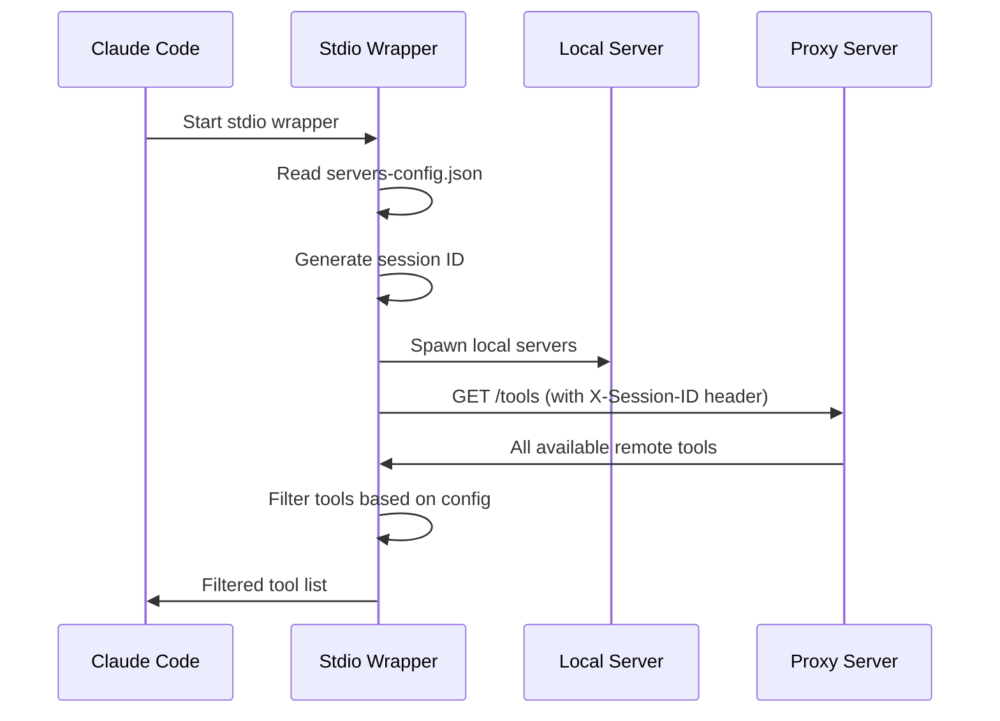
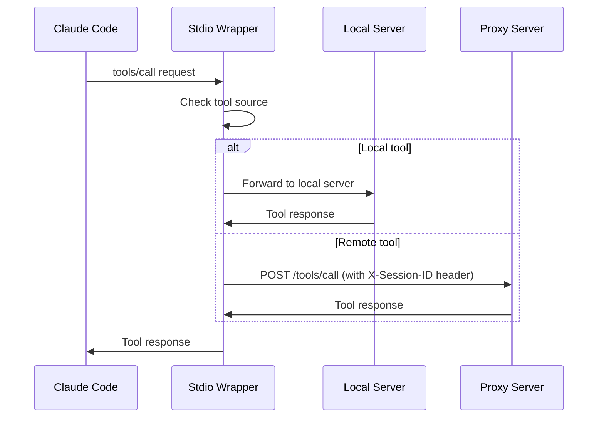

# Client-Side MCP Architecture

## Overview

The MCP Proxy implements a client-side architecture where intelligent routing and tool filtering happens in the stdio wrapper, while the proxy server acts as a simple aggregator for remote tools. This design provides clean separation of concerns, eliminates complex server-side session management, and gives clients full control over their tool environment.

## Architecture Principles

### 1. Smart Client, Simple Server
- **Stdio Wrapper (Client)**: Handles all routing logic, tool filtering, and local server management
- **Proxy Server**: Simple aggregator that exposes all remote tools and forwards requests

### 2. Local vs Remote Execution
- **Local Tools**: Filesystem, git, IDE integration - run directly in client context
- **Remote Tools**: Web APIs, databases, memory - run on server infrastructure

### 3. Header-Based Sessions, Client-Side Filtering
- **Sessions**: Simple header-based session ID for stateful remote servers (memory, databases) that need per-agent data isolation
- **Tool Filtering**: Handled entirely by client-side configuration and local filtering logic

## Configuration

### Client Configuration (`servers-config.json`)
```json
{
  "remoteTools": [
    "web_search",
    "web_summarize", 
    "memory_store",
    "memory_retrieve",
    "db_query"
  ],
  "localServers": {
    "filesystem": {
      "command": "npx",
      "args": ["-y", "@modelcontextprotocol/server-filesystem"],
      "tools": ["read_file", "write_file", "list_directory"],
      "workingDirectory": "project_root"
    },
    "git": {
      "command": "npx", 
      "args": ["-y", "@modelcontextprotocol/server-git"],
      "tools": ["git_status", "git_commit", "git_diff"],
      "workingDirectory": "project_root"
    }
  }
}
```

### Server Configuration (Global)
```yaml
# Server-side configuration - client doesn't need to know these details
servers:
  web-search:
    command: "/usr/bin/web-search-server"
    env:
      API_KEY: "${WEB_SEARCH_API_KEY}"
      
  memory:
    command: "/usr/bin/memory-server"
    storage: "/data/memory"
    
  database:
    url: "postgresql://db:5432/mcp"
```

## Request Flow

### 1. Initialization


### 2. Tool Execution


## Component Responsibilities

### Stdio Wrapper (Client-Side Intelligence)
**Core Responsibilities:**
- Read and parse client configuration (`servers-config.json`)
- Spawn and manage local MCP server processes
- Query proxy server for available remote tools
- Filter all tools based on local configuration
- Route tool calls to appropriate destination (local vs remote)
- Handle session ID generation and management

**Local Server Management:**
- Spawn servers in client's working directory context
- Establish stdio communication channels
- Handle server lifecycle (cleanup on exit)
- Manage process failures and restarts

**Tool Filtering Logic:**
```rust
impl ToolFilter {
    fn should_include_tool(&self, tool_name: &str, source: &ToolSource) -> bool {
        match source {
            ToolSource::Local(server_name) => {
                self.config.local_servers.get(server_name)
                    .map(|server| server.tools.contains(tool_name))
                    .unwrap_or(false)
            }
            ToolSource::Remote => {
                self.config.remote_tools.contains(tool_name)
            }
        }
    }
}
```

### Proxy Server (Simple Aggregator)
**Core Responsibilities:**
- Aggregate tools from all configured remote servers
- Forward tool calls to appropriate remote servers
- Provide session isolation for stateful servers
- Handle server-side resource management

**Simple API:**

```http
GET /tools
X-Session-ID: client-uuid-1234
- Returns all available tools from all remote servers
- No filtering, no session-specific responses

POST /tools/call  
X-Session-ID: client-uuid-1234
- Forwards tool call to appropriate remote server
- Uses X-Session-ID header for stateful servers
- Returns tool execution result
```

**Header-Based Session Handling:**
- Sessions used only for stateful servers (memory, database)
- Session ID passed via `X-Session-ID` header on all requests
- No complex session handshake or management endpoints
- Sessions provide data isolation, not tool filtering
- Generated client-side: `client-${uuid}`

## Benefits

### Simplified Server Management
- **Stateless for most operations**: Only stateful for servers that need data persistence
- **No complex session handshakes**: Simple header-based session identification
- **Easier scaling**: Server can be replicated without session state concerns

### Client Control
- **Full tool visibility**: Client sees exactly what tools are available
- **Local configuration**: All filtering rules defined in client config file
- **Working directory control**: Local servers run in client's project context
- **Offline capability**: Local tools work without proxy server

### Clean Separation of Concerns
- **Network boundary**: Local execution stays local, remote execution goes to server
- **Configuration boundary**: Client config for client concerns, server config for server concerns
- **State boundary**: Client state local, server state remote and isolated

### Performance Benefits
- **Reduced network calls**: Tool list cached locally after initial fetch
- **Local execution**: Filesystem operations don't go over network
- **Parallel execution**: Local and remote tools can execute concurrently

## Implementation Details

### Session ID Generation
```rust
use uuid::Uuid;

fn generate_session_id() -> String {
    format!("client-{}", Uuid::new_v4())
}
```

### Local Server Process Management
```rust
struct LocalServerManager {
    processes: HashMap<String, Child>,
    stdin_handles: HashMap<String, ChildStdin>,
    stdout_handles: HashMap<String, BufReader<ChildStdout>>,
}

impl LocalServerManager {
    async fn spawn_server(&mut self, config: &LocalServerConfig) -> Result<()> {
        let mut cmd = Command::new(&config.command);
        cmd.args(&config.args)
           .current_dir(&config.working_directory)
           .stdin(Stdio::piped())
           .stdout(Stdio::piped());
           
        let child = cmd.spawn()?;
        // Store handles for communication
        Ok(())
    }
}
```

### Tool Call Routing
```rust
impl StdioWrapper {
    async fn route_tool_call(&self, tool_name: &str, args: Value) -> Result<Value> {
        if let Some(server_name) = self.get_local_server_for_tool(tool_name) {
            // Route to local server
            self.call_local_server(server_name, tool_name, args).await
        } else if self.config.remote_tools.contains(tool_name) {
            // Route to proxy server
            self.call_remote_server(tool_name, args).await
        } else {
            Err("Tool not available".into())
        }
    }
}
```

## Security Considerations

### Local Execution Security
- Local servers run in client's security context
- File access limited to client's working directory
- No privilege escalation required
- Client controls all local server processes

### Remote Execution Security
- Session-based data isolation on server
- No direct file system access from remote servers
- API rate limiting and resource quotas on server
- Audit logging with session correlation

### Configuration Security
- Client configuration stored locally
- No sensitive server details exposed to client
- API keys and credentials managed server-side
- Working directory restrictions enforced

## Migration from Session-Based Architecture

### Removed Complexity
- ❌ Complex `/session/init` handshake
- ❌ Server-side tool filtering logic
- ❌ Session-based tool list management
- ❌ Complex session state management

### Retained Benefits
- ✅ Session-based data isolation for stateful servers
- ✅ Local vs remote execution routing
- ✅ Multi-tenant server operation
- ✅ Working directory context handling

### Simplified Implementation
- **Client**: Smart filtering and routing logic
- **Server**: Simple aggregation and forwarding
- **Protocol**: Standard MCP + session header
- **Configuration**: Clear client vs server separation

## Conclusion

This client-side architecture provides the best of both worlds: intelligent client-side control with simple server-side aggregation. By moving filtering logic to the client and using sessions only for stateful operations, we achieve a clean, scalable, and maintainable system that gives users full control over their tool environment while maintaining the benefits of shared server infrastructure.