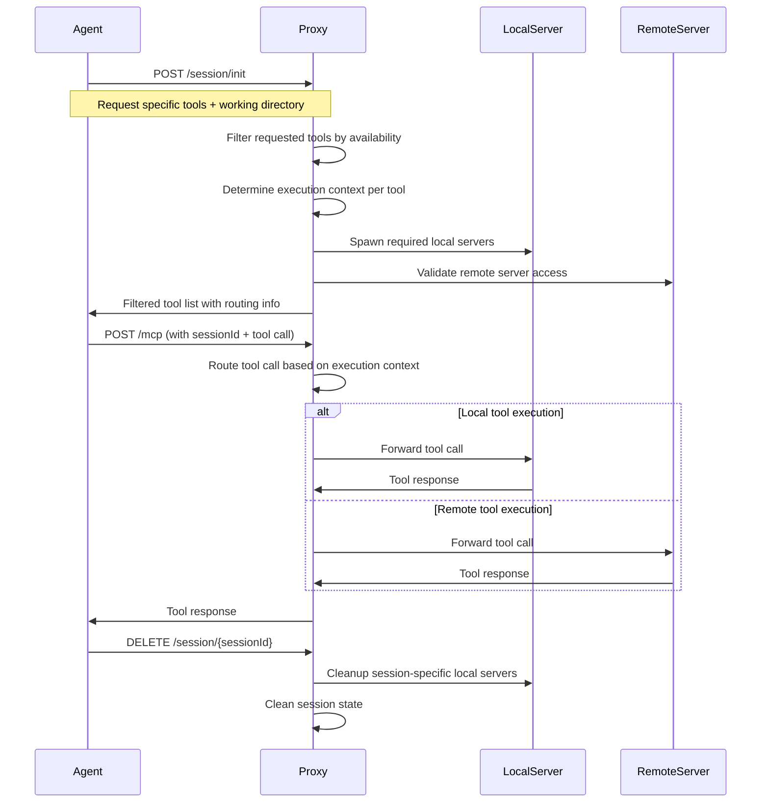
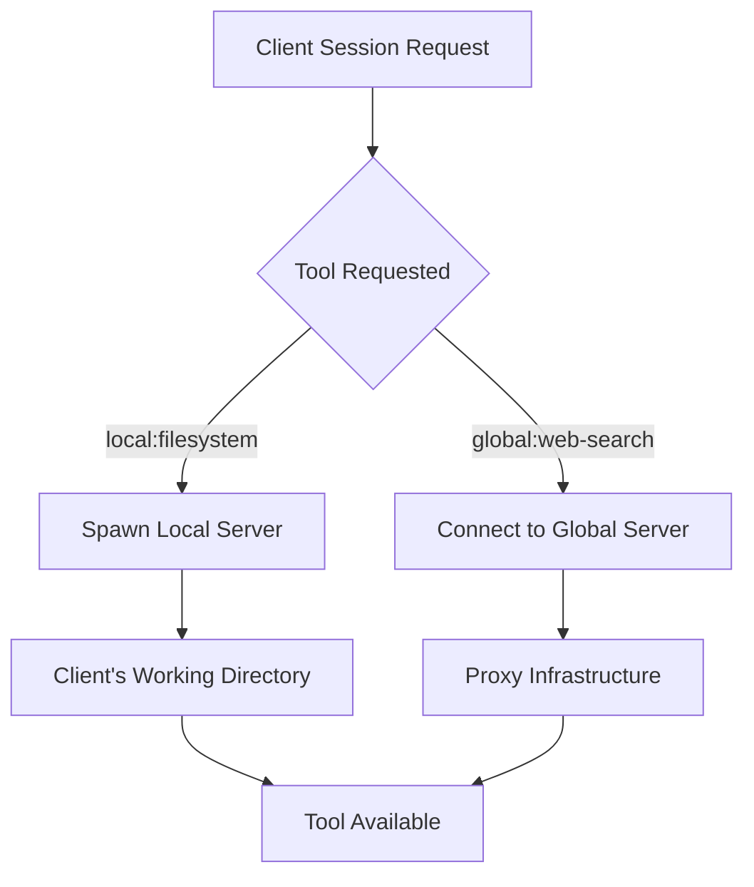

# Session-Based MCP Tool Filtering Architecture

## Overview

The MCP Proxy implements a session-based tool filtering architecture to enable multi-tenant operation with intelligent local vs remote execution context routing. This design allows multiple coding agents to request specific subsets of tools from shared MCP servers while maintaining isolation and optimal execution placement.

## Problem Statement

### Tool Filtering Challenges
Without session-based tool filtering, multiple coding agents would experience:

- **Tool Pollution**: Agent A wants only filesystem tools, but sees all 50+ tools from all servers
- **Security Issues**: Agent A could access tools/capabilities it shouldn't have
- **Configuration Complexity**: No way to give agents only the tools they need
- **Context Conflicts**: Multiple agents using same tools with different working directories

### Local vs Remote Tool Execution
Different MCP tools have different optimal execution contexts:

- **Filesystem tools**: Must run locally to access client's actual project files
- **Web API tools**: Better performance and network access from server infrastructure  
- **Database tools**: Already running in cluster, better to keep server-side
- **Processing tools**: More compute resources available on server

### Local Server Management Challenge
When a coding agent requests a tool that requires local execution (e.g., `filesystem_read_file`):

- **Server Discovery**: Is the required local MCP server already running?
- **Server Spawning**: If not, how do we start it in the client's context?
- **Server Installation**: Future: How do we install new local servers (GitHub URL, etc.)?
- **Working Directory**: How do we ensure the local server runs in the correct project directory?

## Session-Based Solution

### Session Lifecycle



### Session Configuration Handshake

#### 1. Session Initialization Request
```http
POST /session/init
Content-Type: application/json

{
  "clientInfo": {
    "name": "claude-desktop",
    "version": "1.0.0"
  },
  "workingDirectory": "/Users/alice/project-a",
  "localServers": [
    {
      "name": "filesystem",
      "command": "npx",
      "args": ["-y", "@modelcontextprotocol/server-filesystem", "/Users/alice/project-a"],
      "env": {},
      "tools": ["filesystem_read_file", "filesystem_write_file", "filesystem_list_directory"]
    },
    {
      "name": "git", 
      "command": "npx",
      "args": ["-y", "@modelcontextprotocol/server-git"],
      "env": {},
      "tools": ["git_status", "git_commit", "git_diff"]
    }
  ],
  "requestedTools": [
    {"name": "filesystem_read_file", "source": "local:filesystem"},
    {"name": "filesystem_write_file", "source": "local:filesystem"},
    {"name": "web_search", "source": "global:web-search"},
    {"name": "memory_store", "source": "global:memory"},
    {"name": "git_status", "source": "local:git"}
  ]
}
```

#### 2. Session Configuration Response
```http
HTTP/1.1 200 OK
Content-Type: application/json

{
  "sessionId": "session-abc123",
  "protocolVersion": "2024-11-05",
  "capabilities": {
    "tools": {},
    "session": {
      "local_execution": true,
      "remote_execution": true
    }
  },
  "globalServers": {
    "web-search": {
      "tools": ["web_search", "web_summarize"],
      "status": "running"
    },
    "memory": {
      "tools": ["memory_store", "memory_retrieve", "memory_search"],
      "status": "running"
    },
    "database": {
      "tools": ["db_query", "db_insert", "db_update"],
      "status": "running"
    }
  },
  "localServers": {
    "filesystem": {
      "status": "spawned",
      "workingDirectory": "/Users/alice/project-a",
      "tools": ["filesystem_read_file", "filesystem_write_file", "filesystem_list_directory"]
    },
    "git": {
      "status": "spawned", 
      "workingDirectory": "/Users/alice/project-a",
      "tools": ["git_status", "git_commit", "git_diff"]
    }
  },
  "availableTools": [
    {"name": "filesystem_read_file", "source": "local:filesystem", "status": "ready"},
    {"name": "filesystem_write_file", "source": "local:filesystem", "status": "ready"},
    {"name": "web_search", "source": "global:web-search", "status": "ready"},
    {"name": "memory_store", "source": "global:memory", "status": "ready"},
    {"name": "git_status", "source": "local:git", "status": "ready"}
  ]
}
```

### Global + Local Server Model

#### Global Servers (Proxy-Managed)
Global servers run on the proxy infrastructure and provide shared capabilities:

- **Web APIs**: `web-search`, `brave-search` - Better network access from server
- **Databases**: `postgresql`, `redis` - Already running in cluster  
- **Memory/Storage**: `memory`, `vector-db` - Persistent storage with PVC
- **Processing**: `image-generation`, `code-analysis` - More compute resources

**Benefits**: Shared infrastructure, better performance, persistent state, centralized management

#### Local Servers (Client-Spawned)  
Local servers run in the client's execution context for file system access:

- **Filesystem**: `filesystem` - Access client's actual project files
- **Version Control**: `git` - Work with client's repository
- **IDE Integration**: `editor` - Interact with client's development environment
- **Local Tools**: Custom project-specific servers

**Benefits**: Real file access, respect permissions, work with local environment

#### Server Discovery Flow


#### Future Extensions
- **GitHub Server Installation**: `{"source": "github", "url": "https://github.com/user/mcp-server"}`
- **Docker Server Support**: `{"source": "docker", "image": "myserver:latest"}`
- **Custom Command Servers**: `{"command": "/path/to/custom-server"}`

### Execution Context Routing

#### Local Execution Context
- **When**: Filesystem operations, document access, IDE integration
- **Where**: Client's machine, agent's working directory
- **Servers**: `filesystem`, `git`, `editor-integration`
- **Benefits**: 
  - Access to actual user files
  - Respect user's file permissions
  - Work with local development environment

#### Remote Execution Context  
- **When**: Web APIs, databases, processing, memory operations
- **Where**: Kubernetes cluster, server infrastructure
- **Servers**: `web-search`, `databases`, `memory`, `brave-search`
- **Benefits**:
  - Better network connectivity
  - More compute resources
  - Persistent storage (PVC)
  - Shared infrastructure

### Session State Management

```rust
#[derive(Debug, Clone)]
pub struct SessionContext {
    pub session_id: String,
    pub client_info: ClientInfo,
    pub working_directory: PathBuf,
    pub server_configs: HashMap<String, ServerConfig>,
    pub local_servers: HashMap<String, LocalServerHandle>,
    pub created_at: SystemTime,
    pub last_accessed: SystemTime,
}

#[derive(Debug, Clone)]
pub struct ServerConfig {
    pub name: String,
    pub execution_context: ExecutionContext,
    pub command: String,
    pub args: Vec<String>,
    pub env: HashMap<String, String>,
    pub working_directory: Option<PathBuf>,
    pub enabled: bool,
}

#[derive(Debug, Clone, PartialEq)]
pub enum ExecutionContext {
    Local,   // Run on client's machine
    Remote,  // Run on server infrastructure
}
```

## Security Considerations

### Session Isolation
- Each session has isolated server instances
- File access restricted to session's working directory
- API keys scoped to session configuration
- No cross-session data leakage

### Local Execution Security
- Local servers run in client's security context
- File access limited to explicitly allowed directories
- No privilege escalation
- Client controls local server lifecycle

### Remote Execution Security
- Server-side resource limits and quotas
- Network policies for outbound access
- Secrets management for API keys
- Audit logging for all operations

## Implementation Plan

### Phase 1: Session Management Core
1. **Session store** - In-memory session state management
2. **Session endpoints** - `/session/init`, `/session/{id}`, `/session/{id}/destroy`
3. **Session middleware** - Extract and validate session from requests
4. **Configuration handshake** - Parse client preferences and return server config

### Phase 2: Execution Context Routing
1. **Local server spawning** - Spawn MCP servers in client context
2. **Remote server management** - Session-scoped remote server instances
3. **Request routing** - Route tools based on execution context
4. **Tool aggregation** - Combine tools from local and remote servers

### Phase 3: Local Server Integration
1. **Local server protocols** - Communication with client-side servers
2. **Working directory handling** - Proper path resolution
3. **Server lifecycle** - Cleanup on session destruction
4. **Error handling** - Graceful degradation when local servers fail

### Phase 4: Production Features
1. **Session persistence** - Survive proxy restarts
2. **Session timeouts** - Automatic cleanup of stale sessions
3. **Monitoring** - Session metrics and health checks
4. **Load balancing** - Distribute sessions across proxy instances

## Configuration Examples

### Default Server Classifications
```yaml
servers:
  # Local execution (filesystem access)
  filesystem:
    executionContext: local
    allowedDirectories: ["{workingDirectory}"]
  
  git:
    executionContext: local
    workingDirectory: "{workingDirectory}"
  
  # Remote execution (APIs, services)
  web-search:
    executionContext: remote
    
  brave-search:
    executionContext: remote
    env:
      BRAVE_API_KEY: "${BRAVE_API_KEY}"
      
  database:
    executionContext: remote
    
  memory:
    executionContext: remote
    storage: pvc
```

### Client Preferences Override
```json
{
  "preferences": {
    "executionContext": {
      "memory": "local",  // Override: use local memory instead of server PVC
      "git": "remote"     // Override: use server-side git operations
    }
  }
}
```

## Benefits

### For Developers
- **Seamless experience**: Files work locally, APIs work remotely
- **Performance**: Optimal execution placement
- **Security**: Isolated sessions, appropriate permissions
- **Flexibility**: Override execution context based on needs

### For Operations  
- **Scalability**: Multiple agents per proxy instance
- **Resource efficiency**: Share remote infrastructure
- **Monitoring**: Session-based metrics and logging
- **Security**: Audit trail and access controls

### For Architecture
- **Clean separation**: Local vs remote concerns
- **Extensibility**: Easy to add new execution contexts
- **Maintainability**: Clear session boundaries
- **Testability**: Isolated session state

## Conclusion

The session-based architecture with execution context routing provides an elegant solution to multi-agent MCP proxy operation. By defaulting to server-side execution with selective local execution for filesystem operations, we achieve optimal performance while maintaining security isolation and operational simplicity.